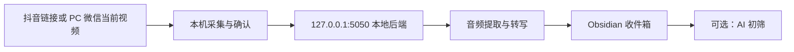

# 短视频收件箱桥接

[](https://github.com/TC-TCQKJJ/obsidian-short-video-inbox/actions/workflows/ci.yml)
[](https://github.com/TC-TCQKJJ/obsidian-short-video-inbox/actions/workflows/build-wechat-process-capture.yml)
[](https://github.com/TC-TCQKJJ/obsidian-short-video-inbox/releases)
[](LICENSE)

把抖音和微信视频号内容提取为音频、转成文字，并写入 Obsidian
收件箱。项目面向 Windows 桌面版 Obsidian，支持豆包录音文件识别和本地
Whisper 备用转写。

微信视频号采集不会复用上游项目公开的根证书和私钥。每台电脑在安装时
生成独立 CA，助手只附加到 PC 微信进程，并把解密范围限制在视频号所需域名。

> 本项目由小楼开发。请只保存你有权访问和留存的内容，并遵守所在地区法律、
> 内容平台规则和版权要求。

## 能做什么

- 把抖音分享链接解析为标题、作者、音频和转写。
- 从 PC 微信识别当前可见的视频号视频，确认后提取完整音频。
- 不保留原始 MP4，只保存音频、转写和必要元数据。
- 在后端暂时不可用时，用 Windows DPAPI 加密待提交任务。
- 把音频附件和转写写回指定的 Obsidian 收件箱。
- 通过豆包 API 转写，或使用本地 Whisper。
- 可与[收件箱 AI 初筛](https://github.com/TC-TCQKJJ/obsidian-inbox-ai-processor)
  连接，在转写完成后生成可审阅的分类和经验卡片建议。

## 处理链路



微信视频号助手的详细实现和安全边界见
[`backend/wechat_capture/README.md`](backend/wechat_capture/README.md) 与
[`SECURITY.md`](SECURITY.md)。

## 环境要求

- Windows 10/11
- Obsidian 1.8.7 或更高版本
- Python 3.10+
- FFmpeg，并已加入 `PATH`
- 豆包语音 API Key；只使用本地 Whisper 时可以不配置
- 从源码构建插件时需要 Node.js 18+
- 从源码构建微信助手时需要 Go 1.23 和 MinGW GCC

## 安装

### 从 Release 安装

推荐下载最新 Release 中的
`obsidian-short-video-inbox-<版本>-windows.zip`。该压缩包包含 Obsidian
插件、本地 Python 后端，以及在 GitHub Actions 中从源码构建并检查过的微信
助手。

解压后，在 PowerShell 中进入目录并安装本地后端：

```powershell
.\scripts\install-backend.ps1
```

把压缩包根目录中的 `main.js`、`manifest.json` 和 `styles.css` 复制到：

```text
<你的 Vault>/.obsidian/plugins/douyin-inbox-bridge/
```

然后在 Obsidian 的“第三方插件”设置中启用“短视频收件箱桥接”。

如果需要采集微信视频号，再安装可选助手：

```powershell
& "$env:LOCALAPPDATA\Xiaolou\DouyinCapture\backend\wechat_capture\install.ps1"
```

该步骤会为当前 Windows 用户创建一张独立的本地根证书，并请求管理员权限
启动进程驱动。安装前请先阅读 [`SECURITY.md`](SECURITY.md)。

### 从源码安装

```powershell
git clone https://github.com/TC-TCQKJJ/obsidian-short-video-inbox.git
cd obsidian-short-video-inbox
npm ci
npm run check
npm test
npm run build
.\scripts\install-backend.ps1
```

从源码构建微信助手：

```powershell
Set-Location .\backend\wechat_process_capture
go mod download
go mod vendor
.\patch-sunnynet.ps1
go test -mod=vendor ./...
New-Item -ItemType Directory -Force -Path .\dist | Out-Null
go build -mod=vendor -trimpath -ldflags "-s -w" `
  -o .\dist\wechat-process-capture.exe .
.\verify-binary.ps1 -Executable .\dist\wechat-process-capture.exe
Set-Location ..\..
.\scripts\install-backend.ps1
& "$env:LOCALAPPDATA\Xiaolou\DouyinCapture\backend\wechat_capture\install.ps1"
```

`patch-sunnynet.ps1` 会在 vendored 源码中移除 SunnyNet 自带的共享 CA
和私钥；`verify-binary.ps1` 会拒绝包含该私钥标记的构建产物。

## 使用微信视频号采集

1. 保持 Obsidian 打开，让插件管理的本地后端运行。
2. 打开桌面的“微信视频号捕获”快捷方式并批准进程驱动权限。
3. 在 PC 微信中打开目标视频并播放几秒。
4. 点击“检查当前视频”，核对标题、作者、时长和封面。
5. 点击“确认保存”，等待音频转写和 Obsidian 写回。

如果 `Ctrl+Alt+S` 被其他程序占用，助手会提示改用
`Ctrl+Alt+Shift+S`。界面按钮不依赖快捷键。

## 设置

- **收件箱目录**：写入最终 Markdown 笔记。
- **附件目录**：保存音频和图文附件。
- **本地后端 URL**：默认 `http://127.0.0.1:5050`。
- **转写引擎**：豆包或本地 Whisper。
- **豆包 API Key**：只保存在当前 Vault 的插件配置 `data.json` 中。
- **录音设备**：直接取得音轨失败时的本地播放录音备用路径。

## 隐私与网络披露

- 项目不含遥测、广告或用户追踪。
- 默认后端只监听本机回环地址。
- 豆包转写会把音频发送至 `openspeech.bytedance.com`。
- 本地 Whisper 不会把音频发送给语音 API，但首次使用时可能从
  Hugging Face 下载模型。
- 抖音解析会访问抖音分享页和媒体 CDN；视频号采集会访问微信页面和媒体
  CDN。
- 把后端 URL 改为远程地址会把音频和相关凭据发送到该服务器。
- API Key、抓取令牌、签名媒体 URL、证书私钥、日志和运行输出均不提交到
  仓库。

## 已知限制

- 仅支持 Windows 桌面环境。
- 微信视频号依赖 PC 微信的私有页面和接口结构，微信升级后可能需要适配。
- 后端目前单 worker 串行转写，多个长视频会依次排队。
- SunnyNet 驱动内部中继监听范围仍是待继续加固的边界，详见
  [`SECURITY.md`](SECURITY.md)。

## 开发与测试

```powershell
npm ci
npm run check
npm test
npm run build
npm run test:backend
```

发布标签必须与 `manifest.json` 和 `package.json` 中的版本一致。发布工作流
会重新测试并构建插件与微信助手、扫描助手中的上游共享私钥标记、生成 SHA256
文件和构建证明，再创建待发布的 GitHub Release。

## 许可

原创代码采用 [MIT License](LICENSE)。部分第三方衍生代码带有额外许可
条件，详见 [`THIRD_PARTY_NOTICES.md`](THIRD_PARTY_NOTICES.md)。
